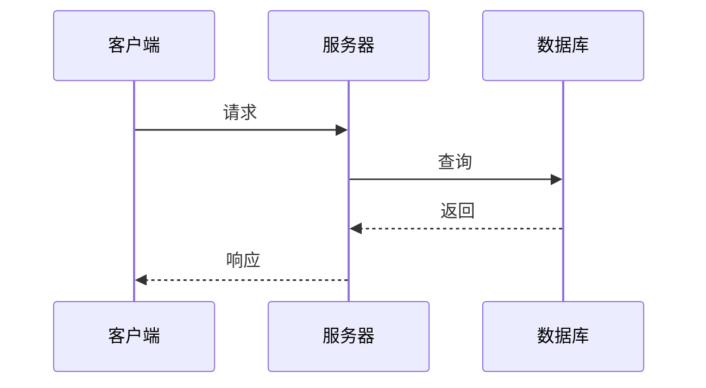

# AI开发对接文档生成模板 - 测试版 v1.0
> 简洁、清晰、AI易填写 | 无作者 | 2025-10-02

---

## 📋 使用说明

**这是给AI看的提示词模板，不是给人看的文档！**

✅ 精简到核心内容，避免AI信息过载  
✅ 每个章节标注优先级和字数建议  
✅ 明确要求"真实值"而非占位符  

---

## 🎯 AI提示词（复制给AI使用）

```
【AI开发对接文档生成要求 - 测试版】

请为本次开发生成对接文档。以下是要求：

═══════════════════════════════════════════════════════════
【核心原则】
═══════════════════════════════════════════════════════════

1. ✅ 使用真实值，不要用占位符（如[文件名]、TODO等）
2. ✅ 代码示例必须可以直接运行
3. ✅ 至少提供一个完整的端到端示例
4. ✅ 标注文件路径和行号
5. ❌ 不要写"待补充"、"参考XX"等推卸责任的话

═══════════════════════════════════════════════════════════
【优先级说明】
═══════════════════════════════════════════════════════════

⭐⭐⭐ [P0-必需] - 缺少会导致无法交接，必须完成
⭐⭐   [P1-重要] - 强烈建议完成，帮助深入理解
⭐     [P2-可选] - 加分项，时间紧张可跳过

═══════════════════════════════════════════════════════════
第一部分：快速上手（15分钟阅读）
═══════════════════════════════════════════════════════════

## 1. 30秒速览 ⭐⭐⭐ [P0-必需] (50字)

一句话说明这次改动：
[用一句话说：做了什么、解决什么问题]

快速启动命令（复制即用）：
```bash
[一行命令启动项目]
```

验证运行：
```bash
[一行命令验证成功]
# 预期输出：[真实输出内容]
```

---

## 2. 核心改动 ⭐⭐⭐ [P0-必需] (200字)

| 类型 | 文件数 | 核心文件 |
|-----|-------|---------|
| 新增 | X个 | [列出最重要的2-3个] |
| 修改 | X个 | [列出最重要的2-3个] |
| 删除 | X个 | [如有则列出] |

影响范围：[哪些模块受影响]
向后兼容：✅兼容 / ⚠️不兼容（说明原因）

---

## 3. 技术栈 ⭐⭐⭐ [P0-必需] (100字)

| 类别 | 技术 | 版本 |
|-----|------|------|
| 语言/框架 | [如：Node.js, Python] | [版本号] |
| 数据库 | [如：PostgreSQL] | [版本号] |
| 核心依赖 | [最重要的2-3个] | [版本号] |

环境要求：
```bash
[如：Node.js >= 18.0.0]
```

---

## 4. 项目结构 ⭐⭐⭐ [P0-必需] (300字)

```
project/
├── src/
│   ├── [目录名]/          # [说明用途]
│   │   └── [文件名.js]       # [新增/修改] [功能说明]
│   └── [其他关键目录和文件]
├── config/
├── tests/
└── [其他重要文件]
```

**只列出本次改动相关的目录和文件，不要全部列出！**

---

═══════════════════════════════════════════════════════════
第二部分：API与数据（核心）
═══════════════════════════════════════════════════════════

## 5. API接口文档 ⭐⭐⭐ [P0-必需] (每个接口300字)

**如果没有API，写"本次开发不涉及API"**

### 接口清单
| 路径 | 方法 | 功能 | 认证 |
|-----|------|------|------|
| [路径] | [GET/POST] | [功能] | ✅/❌ |

### 接口详情（每个接口单独写）

#### [方法] [路径]
**功能**：[一句话说明]

**请求示例**：
```bash
curl -X [方法] http://localhost:[端口][路径] \
  -H "Content-Type: application/json" \
  -d '[请求体]'
```

**成功响应**：
```json
[真实的JSON响应]
```

**常见错误**：
| 状态码 | 说明 |
|-------|------|
| 400 | [错误说明] |
| 401 | [错误说明] |

**JavaScript调用示例**：
```javascript
// 可直接运行的代码
async function example() {
  const response = await fetch('[URL]', {
    method: '[方法]',
    headers: { 'Content-Type': 'application/json' },
    body: JSON.stringify({ [参数] })
  });
  const data = await response.json();
  return data;
}
```

---

## 6. 数据库变更 ⭐⭐⭐ [P0-必需-如有] (每个表200字)

**如果没有数据库变更，写"本次开发未涉及数据库"**

### 新增表：[表名]

**用途**：[一句话说明]

**字段**：
| 字段名 | 类型 | 必填 | 说明 | 索引 |
|-------|------|------|------|------|
| id | [类型] | ✅ | [说明] | 主键 |
| [字段] | [类型] | ✅/❌ | [说明] | [索引类型] |

**建表SQL**：
```sql
CREATE TABLE [表名] (
  [完整的建表语句]
);
```

**迁移命令**：
```bash
[运行迁移的命令]
```

---

═══════════════════════════════════════════════════════════
第三部分：部署与测试（实操）
═══════════════════════════════════════════════════════════

## 7. 环境配置 ⭐⭐⭐ [P0-必需] (200字)

**环境变量**：
```env
# 必需配置
[变量名]=<值>        # [说明用途]

# 可选配置
[变量名]=<值>        # [说明用途]
```

**配置文件**：
- 文件位置：`[路径]`
- 关键配置：`[配置项]` - [说明]

---

## 8. 本地部署 ⭐⭐⭐ [P0-必需] (300字)

```bash
# 1. 克隆代码
git clone [仓库URL]
cd [目录]

# 2. 安装依赖
[命令]

# 3. 配置环境
[命令或手动步骤]

# 4. 初始化数据库（如需要）
[命令]

# 5. 启动
[命令]

# 6. 验证
[验证命令]
# 预期输出：[真实输出]
```

**常见问题**：
- 问题1：[问题描述] → 解决：[方案]
- 问题2：[问题描述] → 解决：[方案]

---

## 9. 测试 ⭐⭐⭐ [P0-必需] (150字)

**运行测试**：
```bash
[运行测试的命令]
```

**测试覆盖率**：[X%]

**关键测试用例**：
- [测试场景1]：测试 [功能]，验证 [结果]
- [测试场景2]：测试 [功能]，验证 [结果]

---

═══════════════════════════════════════════════════════════
第四部分：注意事项（关键）
═══════════════════════════════════════════════════════════

## 10. 已知问题与坑点 ⭐⭐⭐ [P0-必需] (200字)

**必看坑点**：
1. **[坑点描述]**
   - 现象：[什么情况会出现]
   - 避免：[如何避免]

2. **[坑点描述]**
   - 现象：[什么情况会出现]
   - 避免：[如何避免]

**已知Bug**：
| Bug描述 | 影响 | 临时方案 | 计划修复 |
|---------|------|---------|---------|
| [描述] | [范围] | [方案] | [时间] |

**不要动的代码**：
- ❌ `[文件:函数]` - 原因：[说明]

---

## 11. 性能与安全 ⭐⭐ [P1-重要] (150字)

**性能数据**：
- [核心接口]：响应时间 [X]ms，QPS [X]
- 瓶颈：[如有]

**安全检查**：
- [x] 输入验证
- [x] 认证授权
- [ ] [未完成项]

---

═══════════════════════════════════════════════════════════
第五部分：深度理解（加分）
═══════════════════════════════════════════════════════════

## 12. 为什么这样设计？⭐⭐ [P1-重要] (200字)

**技术选型**：
- 选择 [技术A] 而非 [技术B]：因为 [原因]
- 选择 [方案A] 而非 [方案B]：因为 [原因]

**放弃的方案**：
| 方案 | 为何放弃 | 未来是否考虑 |
|------|---------|-------------|
| [方案] | [原因] | ✅/❌ |

---

## 13. 关键代码解释 ⭐⭐ [P1-重要] (每段200字)

**代码片段1：[功能描述]**
```[语言]
// 文件：[路径]
// 行号：[L开始-L结束]
// 功能：[说明]

[代码片段，保留关键部分]

// 关键点：
// 1. [行号范围]：[解释为什么这样写]
// 2. [行号范围]：[解释为什么这样写]
```

**最多写2-3个关键代码片段即可！**

---

## 14. 开发过程记录 ⭐⭐ [P1-重要] (200字)

**踩过的坑**：
| 问题 | 尝试的方案 | 为何失败 | 最终方案 |
|------|-----------|---------|---------|
| [问题] | [方案] | [原因] | [方案] |

**最难的Bug**：[描述] - 如何解决：[方案]

**调试技巧**：[分享一个有用的调试方法]

---

## 15. 架构图 ⭐ [P2-可选] (按需)

**系统架构**：


**数据流**：


**如果架构简单，可以跳过此部分**

---

═══════════════════════════════════════════════════════════
第六部分：后续（必需）
═══════════════════════════════════════════════════════════

## 16. 后续工作 ⭐⭐⭐ [P0-必需] (150字)

**必须完成**：
- [ ] [任务1] - 优先级：P0
- [ ] [任务2] - 优先级：P0

**建议优化**：
- [ ] [任务1] - 优先级：P1
- [ ] [任务2] - 优先级：P1

**技术债务**：
- [债务描述] - 产生原因：[原因] - 建议：[处理建议]

---

## 17. 联系与资源 ⭐⭐⭐ [P0-必需] (100字)

**负责人**：[姓名/AI] - [联系方式]
**代码仓库**：[GitHub URL]
**关键Commit**：`[commit hash]` - [提交信息]
**相关文档**：[链接]

**如果遇到问题**：
1. 先查看 [文档位置]
2. 检查 [日志位置]
3. 联系 [负责人]

---

═══════════════════════════════════════════════════════════
【质量检查清单】
═══════════════════════════════════════════════════════════

生成文档后，请自查：
- [ ] 所有命令可以直接复制运行（没有占位符）
- [ ] 至少有一个完整的端到端示例
- [ ] 代码示例标注了文件路径和行号
- [ ] API示例包含真实的请求/响应
- [ ] 没有"待补充"、"TODO"等推卸责任的话
- [ ] [P0-必需]的章节全部完成
- [ ] 总字数在3000-5000字之间（避免过长）

═══════════════════════════════════════════════════════════
【字数控制建议】
═══════════════════════════════════════════════════════════

总字数目标：3000-5000字

章节字数分配：
- 第一部分（快速上手）：500字
- 第二部分（API与数据）：1000-1500字
- 第三部分（部署测试）：800字
- 第四部分（注意事项）：400字
- 第五部分（深度理解）：600字（可选）
- 第六部分（后续）：300字

⚠️ 如果字数超过5000，说明写得太啰嗦了！
```

---

## 📊 与之前版本的对比

| 特性 | 之前的完整版 | 现在的测试版 | 改进 |
|-----|-------------|-------------|------|
| **总章节数** | 24个 | 17个 | ✅ 减少30% |
| **预计字数** | 8000+ | 3000-5000 | ✅ 减少40% |
| **示例代码** | 每个都很长 | 精简到关键部分 | ✅ 突出重点 |
| **AI理解难度** | 较高 | 中等 | ✅ 更易理解 |
| **填写时间** | 30-60分钟 | 15-30分钟 | ✅ 节省时间 |
| **信息密度** | 过高 | 适中 | ✅ 刚刚好 |

---

## 🎯 使用建议

### 场景1：功能开发
```
我完成了用户认证功能的开发，请使用【测试版模板】生成对接文档。

重点关注：
- API接口文档要完整
- 数据库变更要详细
- 部署步骤要可运行
```

### 场景2：Bug修复
```
我修复了登录失败的Bug，请用【测试版模板】生成简短的对接文档。

可以跳过：
- 架构图（P2-可选）
- 开发过程记录（如果不重要）

重点说明：
- Bug的原因
- 修改了哪些代码
- 如何验证修复成功
```

### 场景3：大型重构
```
我重构了整个认证模块，请用【测试版模板】生成完整文档。

所有章节都要写，包括：
- 为什么这样设计
- 关键代码解释
- 架构图
- 踩坑经验
```

---

## 💡 关键改进点

### 1. 字数限制明确
每个章节标注建议字数，避免AI写太长

### 2. 优先级清晰
P0/P1/P2 三级优先级，AI知道哪些可以跳过

### 3. 去掉冗余
- ❌ 删除：业务术语表（太细）
- ❌ 删除：依赖健康度分析（太深）
- ❌ 删除：AI自检问题（多余）
- ✅ 保留：核心的实操内容

### 4. 强调真实值
多次提醒"不要用占位符"

### 5. 质量检查
最后有checklist让AI自查

---

## 📝 版本信息

- **版本**：测试版 v1.0
- **创建时间**：2025-10-02 08:33 UTC
- **作者**：@oloiverrrr
- **适用AI**：Claude, ChatGPT, Gemini, GitHub Copilot
- **反馈**：如果AI填写效果不好，请继续优化

---

**下一步**：用实际项目测试这个模板，看AI生成的文档质量如何，再根据反馈继续精简！
